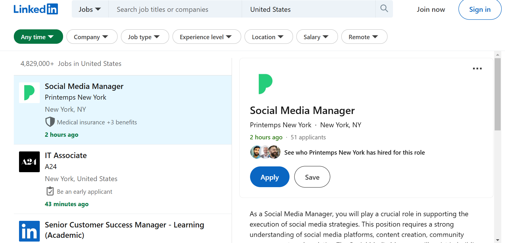

# LinkedIn Job Scraper



## Overview
This project is a **LinkedIn Job Scraper** built using Python. It scrapes job postings from LinkedIn based on specified job titles and locations. The scraper follows an **Object-Oriented Programming (OOP)** approach, making it structured and reusable.


## Features
- Scrapes job listings from LinkedIn based on job title and location.
- Extracts job details such as job title, company name, time posted, number of applicants, and job description.
- Stores extracted job data in a **Pandas DataFrame**.
- Implements **random delays** to avoid detection and blocking.
- Uses **BeautifulSoup** for HTML parsing.

## Installation
### Prerequisites
Ensure you have **Python 3.7+** installed on your system. You also need to install the required dependencies.

### Install Dependencies
```bash
pip install requests beautifulsoup4 pandas
```

## Usage
Clone the repository and navigate to the project directory:
```bash
git clone https://github.com/your-username/linkedin-job-scraper.git
cd linkedin-job-scraper
```

Run the scraper by executing:
```bash
python main.py
```

## Code Structure
The project follows an **OOP structure**:
- **`LinkedInJobScraper` class**:
  - `fetch_job_listings()` – Fetches job listings and extracts job IDs.
  - `extract_job_ids()` – Extracts job IDs from the listings.
  - `scrape_job_details()` – Scrapes detailed job information.
  - `get_text()` – Helper function to extract text safely.
  - `get_dataframe()` – Returns a **pandas DataFrame** of scraped job data.

## Example
Modify `main.py` to scrape jobs by specifying the job title and location:
```python
scraper = LinkedInJobScraper("Python Developer", "Kenya")
scraper.fetch_job_listings()
jobs_df = scraper.get_dataframe()
print(jobs_df)
```

## Output
The extracted job data is structured into a Pandas DataFrame:
```
           job_title          company_name  time_posted  num_applicants  JD
0  Python Developer  Example Company Ltd   3 days ago  50 applicants   ...
1  Data Engineer     Another Tech Corp    5 days ago  30 applicants   ...
```

## Contributing
Feel free to contribute by **submitting a pull request** or **opening an issue**.

## License
This project is licensed under the **MIT License**.

## Disclaimer
This scraper is for **educational purposes only**. Scraping LinkedIn may violate their **Terms of Service**, so use it responsibly.

